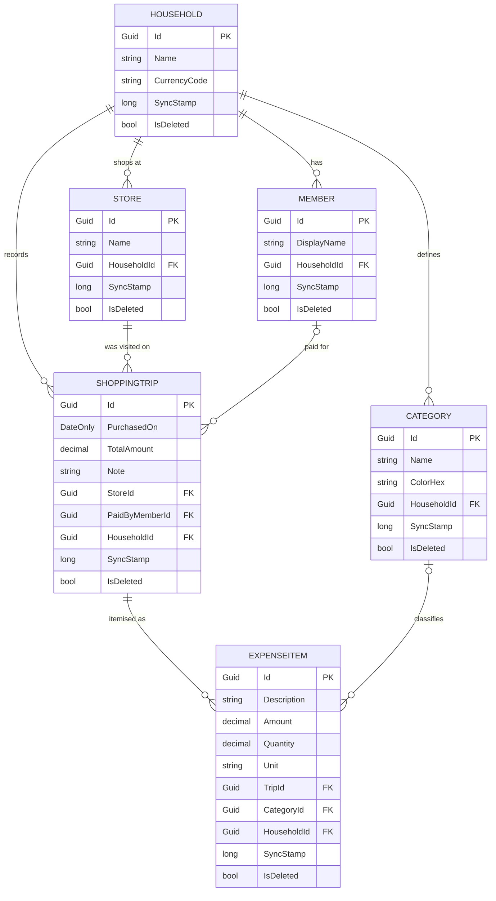

# Domain — Relationships

Every entity below implements `ISyncEntity` (`SyncStamp`, `UpdatedAtUtc`, `IsDeleted`), which is
what makes offline synchronisation possible. Rows are never physically deleted: a delete sets
`IsDeleted`, so a device that was offline at the time still learns about it on its next pull.

## Why a trip carries its own total

`ShoppingTrip.TotalAmount` is what was actually paid and is always authoritative. `ExpenseItem`s
are an **optional** breakdown, so a trip can be logged in seconds at the till and itemised later,
or never.

`SpendAnalyzer` therefore treats the difference between the receipt total and the sum of its items
as uncategorised spend rather than dropping it. If items ever overshoot the receipt — a typo, a
mis-keyed line — their attributions are scaled down proportionally, so the category slices always
add up to exactly the headline total instead of inventing spend that never happened.

## Supporting tables

Two infrastructure tables live alongside these but are not domain entities:

- **`SyncCounters`** — a single row holding the global change counter. Every write increments it
  inside its own transaction, which locks the row until commit and is what makes sync stamps
  strictly commit-ordered.
- **`AppliedSyncOperations`** — the operation ids the server has already applied, so a device that
  never saw a response can safely replay its outbox without duplicating writes.
