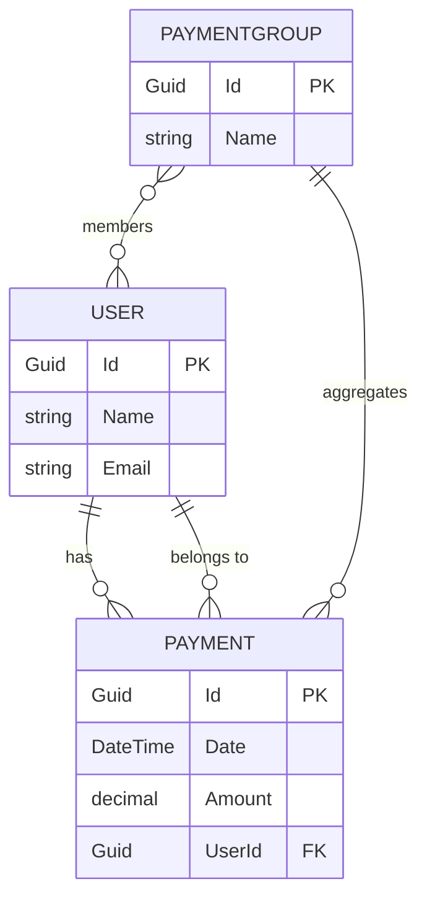

# Domain — Relationships

```mermaid
erDiagram
    USER {
        Guid Id PK
        string Name
        string Email
    }
    PAYMENT {
        Guid Id PK
        DateTime Date
        decimal Amount
        Guid UserId FK
    }
    PAYMENTGROUP {
        Guid Id PK
        string Name
    }

    USER ||--o{ PAYMENT : "has"
    PAYMENT }o--|| USER : "belongs to"
    PAYMENTGROUP }o--o{ USER : "members"
    PAYMENTGROUP ||--o{ PAYMENT : "aggregates"
```
